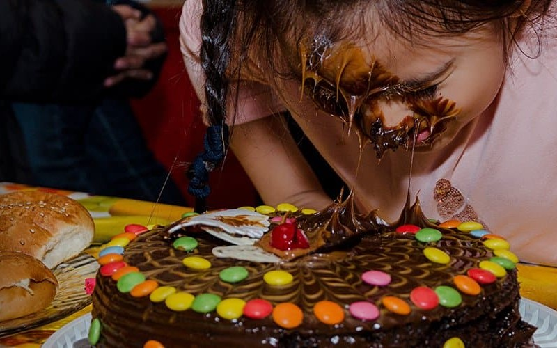

# Mordida

<figure><figcaption>
<a href="https://luzmedia.co/la-mordida-cake-tradition/">Sweet and Savage: Exploring the Cake Smashing Ritual of La Mordida – Luz Media</a>
</figcaption></figure>

### 🐍 **Что такое&#x20;**_**Mordida**_**?**

Слово _mordida_ (испанский) означает буквально **укус**. Это:

* форма _насмешливого ритуала_,
* распространённая в Мексике, Испании, Латинской Америке,
* когда **именинника подталкивают лицом в торт**, как бы «заставляя» его сделать первый укус тортом.

Этот акт сопровождается криком:\
&#xNAN;**«¡Mordida! ¡Mordida!»** — что буквально переводится: _укус! укус!_

Хотя он подаётся как шутка или забава, на духовном уровне это **ритуальное действие**, которое, как увидим, несёт **глубоко антибиблейскую символику**.

***

### 🎉 **Как происходит традиция&#x20;**_**Mordida**_

Вот как традиционно выглядит ритуал в мексиканской или испаноязычной культуре:

* На праздновании дня рождения после пения _«Cumpleaños feliz»_ (аналог «С днём рождения»), выносится торт.
* Именинника приглашают сделать **первый укус без вилки** — **ртом**, что уже само по себе снижает образ человека.
* В момент, когда он приближается, чтобы укусить торт, **кто-то (обычно родственник или друг)** неожиданно **толкает его головой в торт**, часто с силой.
* Все вокруг **смеются**, снимают видео, публикуют в соцсети.

Иногда лицо полностью оказывается в торте, и человеку даже больно — но это подаётся как "традиция", "веселье", "прикол".

***

### 🍰 **Культурная маска и сатанинская подмена**

На первый взгляд, это выглядит как шутка. Но за ней скрыто:

* **насильственное действие**, замаскированное под радость;
* **унижение** образа человека;
* **высмеивание** священного момента рождения.

🎭 Эта маска комедии покрывает дух агрессии, поругания и змеиного укуса.

***

### 📖 **Символика – торт, лицо и укус**

**Торт** — символ праздника, радости, жизни.\
**Лицо** — в Библии символ **славы, достоинства, света Божьего**.\
**Укус** — образ **нападения, змеи, сатаны**, вводящего яд в тело (грех).

📖 _«Да воззрит на тебя Господь светлым лицем Своим…»_ — Числа 6:25\
📖 _«Змей будет жалить тебя в пяту…»_ — Быт. 3:15\
📖 _«Жало же смерти — грех»_ — 1 Кор. 15:56\
📖 _«И увидел я, что смех — безумие…»_ — Еккл. 2:2

Такой «укус» лицом в торт становится **ритуалом поругания образа Божьего** в человеке.

***

### 🕳️ **Прообразы в Писании – укус и падение**

* **Змей в Эдеме** не просто искушал — **укусил в суть**: он унизил человека, заставил усомниться в достоинстве, посрамил.
* **Укус змея в пустыне** (Числа 21) приводил к смерти — и только взирание на медного змея (образ Христа) спасало.
* В Притчах, укус змеи символизирует **незаметный, но смертельный яд**:

📖 _«Как жалит змея и ужалит аспид — так действует язык льстивый...»_ (Притчи 23:32, Пс. 139:4)

Таким образом, укус — это образ **вторжения сатанинского**, действия, направленного **против души**.

***

### 🤡 **Ритуал смеха и унижения**

Смех толпы — важный элемент: он не просто сопровождает действие, он **узаконивает зло**.

📖 _«Смех безумца — как треск терновника под котлом…»_ — Еккл. 7:6\
📖 _«Горе вам, смеющимся ныне…»_ — Луки 6:25\
📖 _«Сидящий на небесах посмеётся…»_ — Пс. 2:4

Смех — это либо знак радости от Бога, либо насмешка над истиной. Здесь он — **насмешка над человеком**, а значит, **сатанинская радость**.

***

### 🏛️ **Духовная структура обряда&#x20;**_**Mordida**_

<table><thead><tr><th width="149.23828125">Элемент</th><th width="189.31640625">Значение в культуре</th><th>Духовная суть</th></tr></thead><tbody><tr><td>Торт</td><td>Праздник, радость</td><td>Символ благословения и жизни</td></tr><tr><td>Лицо</td><td>Смех, забава</td><td>Унижение образа Божьего</td></tr><tr><td>Укус</td><td>Первая проба торта</td><td>Агрессия, внедрение яда (греха)</td></tr><tr><td>Смех толпы</td><td>Забавный момент</td><td>Массовое одобрение поругания</td></tr><tr><td>Неожиданность</td><td>Шутка</td><td>Ловушка, как у дьявола</td></tr></tbody></table>

***

### 🚨 **Духовное разоблачение – это не безобидная традиция**

#### Это не просто шутка. Это:

* **Ритуал инициации в духе насмешки и унижения**
* **Акт угошения света лица Божьего**
* **Змеиный укус, замаскированный под "веселье"**
* **Поругание момента рождения**, что по сути и есть **насмешка над Творцом**

> 📖 _«Бог создал человека по образу Своему…»_ — Быт. 1:27\
> 📖 _«Проклят, кто делает что-либо гнусное втайне…»_ — Втор. 27:15

Здесь нет ничего святого. Эта традиция — **пародия сатаны на рождение и благословение**, выраженная в языке укуса, насмешки и лицом в сладкое.

***

### ✅ **Разоблачённый дух mordida**

🎂 Традиция «лицом в торт» — это не просто забава, а **обрядовое действие**, которое:

* **унижает личность**,
* **оскверняет праздник жизни**,
* **воспроизводит образ укуса змея** — нападения сатаны,
* **вовлекает участников в массовое одобрение насилия**.

Это — **антибиблейская, демоническая пародия** на радость, идущая вразрез с природой Божьей любви, чести и уважения к жизни.
